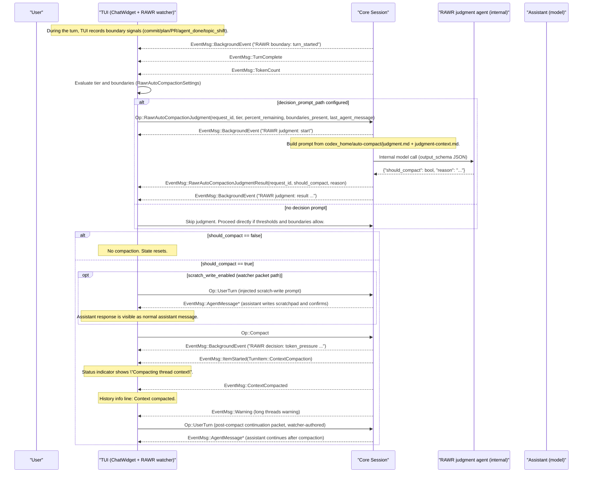

# RAWR Auto‑Compaction “Golden Path” (Status vs Messages)

This document shows the current canonical, end‑to‑end RAWR auto‑compaction flow and **exactly** what
surfaces as TUI status lines vs system/info lines vs assistant messages. It uses the **official**
event/operation types already in the codebase.

## 1) Golden path sequence (auto mode + judgment prompt + watcher packet)



**Legend**
- `EventMsg::*` are server → client events.
- `Op::*` are client → server operations.
- `EventMsg::AgentMessage*` denotes streaming message events (`AgentMessageDelta`/`AgentMessage`).

## 2) Status vs message surfaces (what the user actually sees)

| Surface | Source type | Example in this flow | Where it appears |
|---|---|---|---|
| **TUI status indicator** | `EventMsg::BackgroundEvent` **or** `EventMsg::ItemStarted(TurnItem::ContextCompaction)` | `RAWR boundary: commit` / `RAWR decision: token_pressure ...` / `Compacting thread context` | Live status block above composer (not in transcript) |
| **System/info line** | `history_cell::new_info_event` (TUI‑side) | `Context compacted.` on `EventMsg::ContextCompacted` | Transcript/history list |
| **Warning line** | `EventMsg::Warning` | “Heads up: Long threads …” | Transcript/history list |
| **Assistant message** | `EventMsg::AgentMessageDelta/AgentMessage` | Scratch‑write confirmation; continuation after compaction | Transcript/history list |
| **Injected user message** | `Op::UserTurn` + `history_cell::new_user_prompt` | Scratch prompt; post‑compact packet | Transcript/history list (user role) |
| **Judgment result** | `EventMsg::RawrAutoCompactionJudgmentResult` | `should_compact` boolean + reason | TUI emits `[rawr] auto-compaction judgment: …` info line |
| **Watcher decisions** | TUI info lines | `[rawr] auto-compaction: requesting scratch write` | Transcript/history list |

## 3) Judgment agent prompt (actual text + decision context)

### Base instructions (file)
Path: `codex_home/auto-compact/judgment.md` (seeded from `rawr/prompts/rawr-auto-compaction-judgment.md`)

```
[rawr] You are an internal scheduler deciding whether to trigger RAWR auto-compaction **right now**.

Rules:
- This is an **internal** decision. Do not write prose.
- Output **only** strict JSON (no code fences, no markdown).
- The JSON must match this schema:
  - {"should_compact": boolean, "reason": string}
- Be conservative in Early/Ready tiers: prefer keeping context together unless this is a true phase boundary.
- Never veto Emergency tier compaction (Emergency always compacts).

Decision context will be provided in the user message.
```

### Decision context (user message template)
Source: `codex_home/auto-compact/judgment-context.md` (seeded from `rawr/prompts/rawr-auto-compaction-judgment-context.md`)

```
You are deciding whether to trigger RAWR auto-compaction right now.

Return JSON matching the schema.

Context:
- tier: {tier}
- percentRemaining: {percentRemaining}
- boundariesJson: {boundariesJson}
- threadId: {threadId}
- turnId: {turnId}
- totalUsageTokens: {totalUsageTokens}
- modelContextWindow: {modelContextWindow}

Last agent message (most recent):
{lastAgentMessage}

Recent transcript excerpt (newest last):
{transcriptExcerpt}
```

### Output schema (enforced)
The request is sent with an explicit output schema (JSON):

```
{"should_compact": boolean, "reason": string}
```

## 4) Roles and responsibilities (official names)

- **Core Session**: Executes compaction, emits `EventMsg::ItemStarted/ItemCompleted`, `EventMsg::ContextCompacted`, and `EventMsg::Warning`. Hosts the **judgment agent** internal call.
- **RAWR auto‑compaction watcher (TUI/ChatWidget)**: Evaluates thresholds/boundaries, issues `Op::RawrAutoCompactionJudgment` and `Op::Compact`, injects scratch/packet prompts (`Op::UserTurn`), and surfaces info lines.
- **Judgment agent (internal)**: Runs the decision prompt, returns JSON (`should_compact`, `reason`), never modifies transcript.
- **Assistant (model)**: Produces user‑visible replies, including responses to scratch‑write and continuation prompts.
- **TUI system surface**: Shows live status indicator and history/info lines based on events above.

## 5) Where to tweak behavior/presentation (quick map)

- **Need more live visibility?** Emit `EventMsg::BackgroundEvent` from core/RAWR for each boundary or phase, and TUI will display it as status header + details.
- **Need more/less transcript noise?** TUI info lines (`[rawr] ...`) can be added/removed per phase without touching core behavior.
- **Need richer judgment context?** Edit `codex_home/auto-compact/judgment-context.md` (placeholder expansion happens at runtime).
