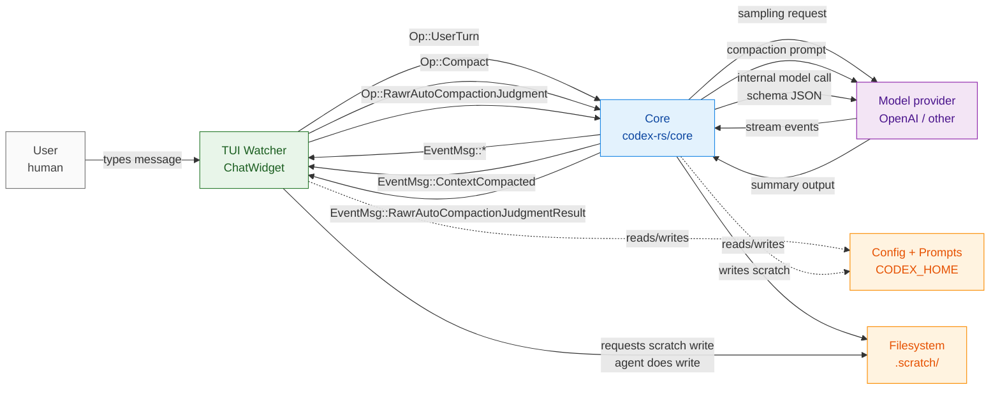
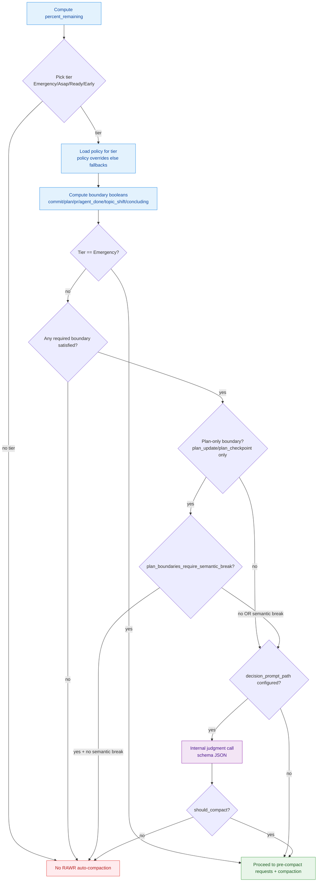
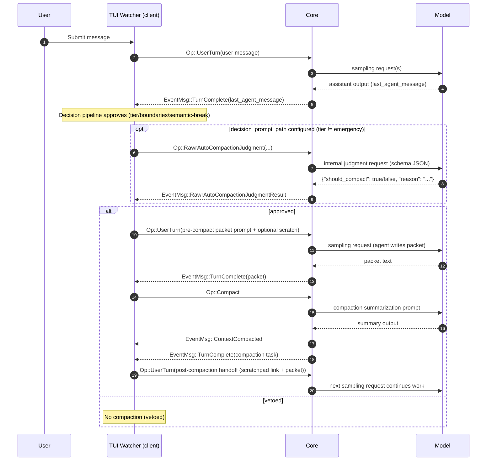
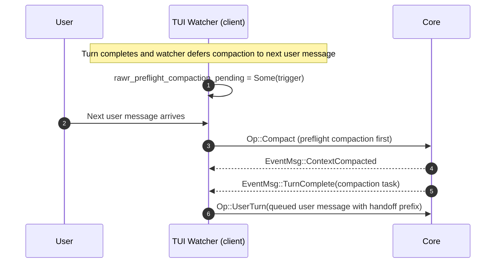

# RAWR Auto-Compaction — Canonical System + State Machine Spec

Status: living spec (fork-specific, current behavior + intent)

This document is the **canonical packet** describing how RAWR auto-compaction works end-to-end in this fork:

- **Actors / systems** (TUI watcher, core sampling loop, compaction task, model provider)
- **Config + prompts** (what exists, where it is loaded from, when it is used)
- **State machines** (TUI watcher and core mid-turn), and the **decision policy** (tiers/boundaries/judgment)
- **All major paths** (watcher auto, watcher suggest/tag, watcher preflight, core mid-turn, built-in auto-compact)
- **Constraints + rationale** (what we optimized for, what we explicitly avoided)

If the UX still feels bad (too eager, confusing, brittle), this doc is intended to make it obvious whether the root cause is:

- config policy values,
- prompt content,
- state machine sequencing / injection mechanics,
- missing context for the judgment decision,
- or a true logic bug.

---

## 0) Scope and ownership boundaries (fork vs upstream)

### What this fork owns

Fork-specific RAWR features (guarded behind `Feature::RawrAutoCompaction`):

- TUI watcher compaction orchestration (turn-complete + preflight)
  - `codex-rs/tui/src/chatwidget.rs`
- Core mid-turn RAWR compaction orchestration (inside one user turn)
  - `codex-rs/core/src/codex.rs`
  - `codex-rs/core/src/rawr_auto_compaction.rs`
- Scratch-write pre-compact request (`.scratch/agent-<name>.scratch.md`)
  - core + TUI
- Config-driven tier policy matrix: `rawr_auto_compaction.policy.<tier>`
  - core + TUI
- Optional **internal / non-transcript** judgment decision step
  - protocol `Op::RawrAutoCompactionJudgment` + `EventMsg::RawrAutoCompactionJudgmentResult`
  - core implementation in `codex-rs/core/src/rawr_auto_compaction_judgment.rs`

### What we do not alter (Codex-native / upstream behaviors)

- Built-in auto-compaction and compaction task mechanics (history rewrite)
  - `codex-rs/core/src/compact.rs`
- Remote compaction feature (`Feature::RemoteCompaction`)
  - still supported; RAWR simply avoids relying on it for judgment (judgment must not mutate transcript)

---

## 1) Actors / components

### Actors

- **User**: human driving the CLI.
- **In-session agent**: the assistant responding to the user (model sampling loop).
- **Watcher (TUI)**: deterministic orchestrator in the TUI that decides *when* to compact at turn completion.
- **Core**: the engine that runs sampling loops, executes tasks, and mutates session state/history.
- **Model provider / backend**: OpenAI (or other providers) handling model requests.
- **Filesystem**: scratchpad persistence under `.scratch/`.

### Components (where to look in code)

- TUI watcher and injection:
  - `codex-rs/tui/src/chatwidget.rs`
- Core mid-turn RAWR compaction:
  - `codex-rs/core/src/codex.rs` (sampling loop)
  - `codex-rs/core/src/rawr_auto_compaction.rs` (tier policy + prompt building)
- Compaction task (history rewrite):
  - `codex-rs/core/src/compact.rs`
  - `codex-rs/core/src/compaction_audit.rs`
- Judgment (internal model call, non-transcript):
  - `codex-rs/core/src/rawr_auto_compaction_judgment.rs`
  - protocol definitions in `codex-rs/protocol/src/protocol.rs`

---

## 2) Terminology

- **Turn**: processing one user input.
- **Sampling request**: one model request within the core sampling loop; a turn can have multiple sampling requests.
- **Compaction task**: `Op::Compact` which rewrites session history.
- **Watcher compaction**: compaction initiated by the TUI at turn completion (and optionally preflight).
- **Mid-turn RAWR compaction**: compaction initiated by core *inside* the sampling loop while the agent still “needs follow-up”.
- **Tier**: urgency bucket selected by `percent_remaining` thresholds: `Early`, `Ready`, `Asap`, `Emergency`.
- **Boundary**: an observable signal suggesting a phase boundary (commit, plan checkpoint/update, agent done, etc.).
- **Semantic break**: derived from the assistant message heuristics:
  - done / topic shift / concluding thought.
- **Pre-compact request**: work that must happen before compaction (scratch write, continuation packet creation).
- **Packet**: continuation context packet produced by the agent (or synthesized by watcher) used as the post-compaction handoff.
- **Handoff**: the injected user message after compaction that re-seeds the agent.

---

## 3) Runtime configuration (source of truth)

All config keys referenced below are defined in:

- `codex-rs/core/src/config/types.rs` (Rust config structs)

### Feature flag

RAWR auto-compaction is gated by:

```toml
[features]
rawr_auto_compaction = true
```

If this is `false`, RAWR watcher and mid-turn logic do not run (and built-in auto-compaction may apply).

### Primary RAWR config

```toml
[rawr_auto_compaction]
mode = "auto"          # tag | suggest | auto
packet_author = "agent" # watcher | agent
scratch_write_enabled = true

# Optional overrides used for watcher-triggered compaction tasks
# compaction_model = "gpt-5.2"
# compaction_reasoning_effort = "high"
# compaction_verbosity = "high"

[rawr_auto_compaction.policy.early]
percent_remaining_lt = 85
requires_any_boundary = ["plan_checkpoint", "plan_update", "pr_checkpoint", "topic_shift"]
plan_boundaries_require_semantic_break = true
decision_prompt_path = "judgment.md" # resolved relative to codex_home/auto-compact

[rawr_auto_compaction.policy.ready]
percent_remaining_lt = 75
requires_any_boundary = ["commit", "plan_checkpoint", "plan_update", "pr_checkpoint", "topic_shift"]
plan_boundaries_require_semantic_break = true
decision_prompt_path = "judgment.md" # resolved relative to codex_home/auto-compact

[rawr_auto_compaction.policy.asap]
percent_remaining_lt = 65
requires_any_boundary = ["commit", "plan_checkpoint", "plan_update", "pr_checkpoint", "agent_done", "topic_shift", "concluding_thought"]

[rawr_auto_compaction.policy.emergency]
percent_remaining_lt = 15
# Emergency tier is a hard bypass; boundaries/judgment are ignored
```

### Optional: structured state store + repo observation (fork-only, best-effort)

When `Feature::RawrAutoCompaction` is enabled, core also writes a **side-channel** structured state store
under `codex_home/rawr/auto_compaction/threads/<thread_id>/`:

- `events.jsonl`: structured boundary events (turn start, plan update/checkpoint, commit, PR checkpoint, semantic boundaries, compaction completed), optionally including repo snapshots.
- `decisions.jsonl`: shadow arbiter decisions derived from policy + state (record-only; not enforced yet). To avoid noise, decisions are only persisted when the system is under token-pressure (tier eligible) or after compaction completes.
- `state.json`: latest snapshot (turn signals, last repo snapshot, last compaction, last decision).

Note: token-pressure (mid-turn) shadow decisions are further deduped in-memory and only emitted when the tier escalates (e.g. `early` → `ready` → `asap` → `emergency`).

Repo observation is lightweight and best-effort:

```toml
[rawr_auto_compaction.repo_observation]
graphite_enabled = true
graphite_max_chars = 4096
```

#### Policy precedence rules (critical)

Both TUI watcher and core mid-turn use the same precedence:

1. If `rawr_auto_compaction.policy.<tier>` is set:
   - it overrides that tier’s `percent_remaining_lt`, `requires_any_boundary`,
     `plan_boundaries_require_semantic_break`, and `decision_prompt_path`.
2. If policy for a tier is not set:
   - fallback to defaults (prompt frontmatter defaults in TUI, and built-in defaults in core).

This lets you control “fires too often” primarily by adjusting config rather than code.

### Important: `mode` only affects the TUI watcher

`rawr_auto_compaction.mode` (`tag`/`suggest`/`auto`) is a **TUI watcher** behavior knob:

- `tag`: print “would compact” informational message
- `suggest`: print “recommend compact” informational message
- `auto`: actually run the watcher orchestration (packet/scratch/compact/handoff)

Core mid-turn RAWR compaction **does not consult `mode`**; it is gated by the feature flag and the
mid-turn decision policy (tiers/boundaries/judgment). This is intentional: mid-turn exists to prevent
context exhaustion while the agent still needs follow-up inside the sampling loop.

---

## 4) Prompt inventory (all prompts and “prompt-y” fallbacks)

### Curated prompt files (codex_home/auto-compact)

All RAWR auto-compaction prompts live under **codex_home/auto-compact/** at runtime. If the files
do not exist, Codex seeds them from the in-repo defaults under `rawr/prompts/` so you can edit
them without code changes.

| Prompt file | Used by | When used | How used |
|---|---|---|---|
| `codex_home/auto-compact/auto-compact.md` | Core + TUI | Pre-compact request: continuation packet | YAML frontmatter drives thresholds + packet rules; body becomes the packet prompt (supports `{scratchFile}` / `{scratch_file}` and `{threadId}`). |
| `codex_home/auto-compact/scratch-write.md` | Core + TUI | Pre-compact request: scratch write | Template with `{scratchFile}` / `{scratch_file}` and `{threadId}`. Injected as a synthetic user turn (TUI watcher) or prepended before packet prompt (core mid-turn, and TUI when `packet_author="agent"`). |
| `codex_home/auto-compact/judgment.md` | Core (executed), TUI (requests) | Optional decision step before compaction | Base instructions for the schema-constrained internal judgment call. TUI triggers via `Op::RawrAutoCompactionJudgment`, core emits `EventMsg::RawrAutoCompactionJudgmentResult`. |
| `codex_home/auto-compact/judgment-context.md` | Core | Decision context template | Human-editable template expanded with runtime placeholders (see below). |
| `rawr/prompts/rawr-auto-compact-heads-up.md` | Currently unused (spec only) | Proposed UX: heads-up before packet/compact | Exists as an artifact for a future “heads-up banner” UX. Not referenced by current code paths. |

### Inline fallbacks (only if prompt files cannot be read)

If the prompt directory is missing or unreadable, defaults embedded in the binary are used (and a
warning is logged):

- Defaults are embedded from `rawr/prompts/*` via `codex_core::rawr_prompts`.
- Watcher-authored packet (when `packet_author="watcher"`) is still built in code:
  - `ChatWidget::rawr_build_post_compact_packet(...)` in `codex-rs/tui/src/chatwidget.rs`

### Judgment context placeholders (judgment-context.md)

Available placeholders (expanded at runtime):

- `{tier}`
- `{percentRemaining}`
- `{boundariesJson}`
- `{lastAgentMessage}`
- `{transcriptExcerpt}`
- `{threadId}`
- `{turnId}`
- `{totalUsageTokens}`
- `{modelContextWindow}`

### Prompts used by compaction itself (upstream / Codex-native)

The compaction task rewrites history by prompting the model to produce a summary:

- `codex-rs/core/templates/compact/prompt.md` (summarization prompt)
- `codex-rs/core/templates/compact/summary_prefix.md` (prefix for the inserted summary message)

These are unrelated to RAWR’s continuation packet prompts; they govern how the compacted history summary is generated.

---

## 5) System overview diagram (actors + handoffs)

This is a **system diagram** (not a state machine) showing the major actors and event handoffs.



---

## 6) Shared decision policy (tiers → boundaries → semantic break → optional judgment)

This is the **decision pipeline** used in both watcher and mid-turn RAWR:

1. Compute `percent_remaining` (0..=100).
2. Pick a tier by thresholds: `Emergency → Asap → Ready → Early` (first match wins).
3. Determine which boundaries “count” at this tier:
   - `allowed_boundaries_for_tier(tier)` (defaults) OR policy override
   - `required_boundaries` = (policy requires list) OR (legacy config list) OR defaults
   - effective check is `required ∩ allowed` (policy cannot force disallowed boundaries early)
4. Compute boundary satisfaction:
   - plan: `plan_checkpoint` / `plan_update`
   - non-plan: `commit` / `pr_checkpoint`
   - semantic: `agent_done` / `topic_shift` / `concluding_thought`
5. Apply “plan boundaries require semantic break” (if enabled for the tier):
   - if only a plan boundary is present and there is no semantic break, do **not** compact.
6. If tier != `Emergency` and a `decision_prompt_path` is configured:
   - perform **non-transcript** judgment model call for `{should_compact, reason}`
   - honor veto if `should_compact=false`
7. If approved: begin pre-compact requests, then compaction.

### Decision flow diagram (code-level plane)



### Why `plan_boundaries_require_semantic_break` exists (and why it’s configurable)

Rationale:

- Plan tool activity is often **mid-phase** (a plan update/checkpoint can happen while work is still ongoing and tightly related).
- Treating plan activity as a “natural boundary” by itself causes “fires too often” compactions.
- But removing plan boundaries entirely makes it hard to compact at real phase boundaries because plan completion is one of the strongest signals.

So the compromise is:

- Keep plan boundaries as candidates, but in Early/Ready require a semantic break unless a non-plan boundary is also present.

Why configurable:

- Some workflows want plan completion to be a hard boundary even without the agent emitting “done/topic shift” language.
- The knob allows you to relax this requirement per tier without editing code.

Default behavior when unset:

- `true` for Early/Ready
- `false` for Asap/Emergency

Implemented in:

- TUI watcher: `codex-rs/tui/src/chatwidget.rs` (semantic-break gate)
- Core mid-turn: `codex-rs/core/src/rawr_auto_compaction.rs` (semantic-break gate)

---

## 7) TUI watcher state machine (turn-complete + preflight)

### Preconditions (gates)

The watcher only runs when:

- `Feature::RawrAutoCompaction` is enabled
- the UI is not in review mode
- token info is present (can compute `percent_remaining`)
- we are not already mid-sequence (state != `Idle`)

### State definitions (exact)

Defined in `codex-rs/tui/src/chatwidget.rs`:

- `Idle`
- `AwaitingScratchWrite { trigger, packet_author }`
- `AwaitingJudgment { trigger, settings, should_defer_to_next_user_turn }`
- `AwaitingPacket { trigger, packet_author }`
- `Compacting { trigger, packet_author, packet, saw_context_compacted, saw_turn_complete, should_inject_packet }`

Where `trigger` captures percent remaining + boundary booleans + last agent message + optional scratch file path.

### State diagram (code-level plane)

```mermaid
stateDiagram-v2
  [*] --> Idle

  Idle --> AwaitingJudgment: auto mode + would_compact + has decision prompt + non-emergency
  Idle --> AwaitingScratchWrite: watcher author + scratch scheduled
  Idle --> AwaitingPacket: agent author + inject packet prompt
  Idle --> Compacting: watcher author + send compact op

  AwaitingJudgment --> Idle: veto or ignored result
  AwaitingJudgment --> AwaitingScratchWrite: approve + watcher author + scratch scheduled
  AwaitingJudgment --> AwaitingPacket: approve + agent author
  AwaitingJudgment --> Compacting: approve + watcher author + no scratch
  AwaitingJudgment --> Idle: approve + preflight defers

  AwaitingScratchWrite --> Compacting: watcher author + scratch done
  AwaitingScratchWrite --> AwaitingPacket: agent author + scratch done

  AwaitingPacket --> Compacting: store packet + send compact op

  Compacting --> Idle: if should_inject_packet=false
  Compacting --> Compacting: on ContextCompacted; mark saw_context_compacted=true
  Compacting --> Idle: after compaction turn complete + packet injected
```



### Watcher: key transitions (step-by-step)

#### A) Decision happens at turn completion (`maybe_rawr_auto_compact`)

When a task completes, the TUI calls `maybe_rawr_auto_compact(last_agent_message)`:

1. If currently in a state waiting on scratch/judgment/packet/compaction, it advances that state machine.
2. Otherwise (`Idle`), it computes:
   - `percent_remaining`
   - tier selection
   - boundary satisfaction (+ semantic-break gate)
3. In `mode="tag"` or `mode="suggest"`:
   - it prints a message and **does not** compact.
4. In `mode="auto"`:
   - if `decision_prompt_path` is configured for this tier (and not emergency),
     it enters `AwaitingJudgment` and submits `Op::RawrAutoCompactionJudgment`.
   - otherwise it proceeds into the scratch/packet/compact sequence immediately.

#### B) Judgment result event handling (non-transcript)

Event: `EventMsg::RawrAutoCompactionJudgmentResult(ev)`

Handler: `ChatWidget::rawr_on_auto_compaction_judgment_result(ev)`

Behavior:

- If state is not `AwaitingJudgment`, ignore.
- If veto: return to `Idle` (no compaction).
- If approve:
  - If `should_defer_to_next_user_turn` (TurnComplete preflight case), set `rawr_preflight_compaction_pending = Some(trigger)` and return `Idle`.
  - Else call `rawr_begin_auto_compaction_from_trigger(trigger, settings)`.

#### C) Scratch write (pre-compact request)

If scratch is scheduled:

- Packet-author = watcher:
  - transition to `AwaitingScratchWrite`
  - inject scratch prompt as a synthetic user turn
- Packet-author = agent:
  - scratch instructions are prepended into the injected packet prompt

Scratch file naming:

- `.scratch/agent-<name>.scratch.md`
- `<name>` derived from session source (subagent identity) or stable deterministic fallback.

#### D) Packet creation

Two variants:

- `packet_author="agent"`:
  - TUI injects the continuation packet prompt (possibly preceded by scratch prompt).
  - On the next `TurnComplete`, TUI treats `last_agent_message` as the packet and proceeds to compaction.
- `packet_author="watcher"`:
  - TUI synthesizes a packet in code (`rawr_build_post_compact_packet`).
  - It proceeds directly to compaction without asking the model for a packet first.

#### E) Compaction

TUI calls `rawr_trigger_compact()`:

- records `CompactionTrigger::AutoWatcher{...}` via `codex_core::compaction_audit::set_next_compaction_trigger(...)`
- clears token usage display in the UI
- emits `Op::Compact`

#### F) Post-compaction packet injection / handoff

TUI handles `EventMsg::ContextCompacted`:

- If we already saw compaction task completion and should inject, inject immediately.
- Otherwise mark `saw_context_compacted=true` and wait for the compaction `TurnComplete`.

Packet injection behavior:

- If no queued user message: inject a synthetic user turn with handoff message.
- If there is a queued user message:
  - store handoff in `rawr_post_compact_handoff_pending`
  - prefix the next queued user message with the handoff (avoids extra model turn)

#### G) Preflight: defer compaction to “next user message”

When `TurnComplete` boundary is in the effective required boundaries and `packet_author="watcher"`,
the watcher can **defer** compaction until the next real user input:

- set `rawr_preflight_compaction_pending`
- on next queued user message, compact before sending it

This reduces “compaction in the middle of a natural workflow” at turn completion.

---

## 8) Core mid-turn RAWR compaction (sampling-loop state machine)

### Why mid-turn exists

Mid-turn compaction is intended to prevent “run out of context while the agent still needs follow-up”:

- The core sampling loop can require multiple requests to finish one user turn.
- If token budget gets tight mid-turn, compaction may be needed before the agent can finish.

### Mid-turn state machine

Defined in `codex-rs/core/src/codex.rs`:

- `RawrMidTurnCompactionPhase::Idle`
- `RawrMidTurnCompactionPhase::AwaitingPacket { trigger }`
- `RawrMidTurnCompactionPhase::AwaitingHandoff`

High-level behavior:

1. During the sampling loop, after each sampling request:
   - update semantic boundary signals from the last assistant message
   - compute `percent_remaining`
   - run the tier/boundary/judgment decision pipeline (shared semantics)
2. If “would compact”:
   - first schedule **pre-compact requests** (agent packet; scratch optional)
   - enter `AwaitingPacket` and inject the packet prompt as a synthetic user message
3. When the injected prompt finishes:
   - treat the last assistant message as the packet
   - run compaction
   - schedule a post-compaction handoff injection
4. The loop continues; the handoff is injected as a synthetic user message before the next sampling request input is assembled.

#### Mid-turn note: packet author is effectively always “agent”

Mid-turn compaction is always preceded by an agent-authored continuation packet prompt (and optional scratch prompt).
Even if the user’s config prefers `packet_author="watcher"`, mid-turn still needs a reliable pre-compact artifact, so
it uses the agent packet prompt path to enforce “pre-compact request before compact” deterministically.

This is one reason mid-turn can feel different from turn-complete watcher compaction.

### Mid-turn rearm / loop prevention (critical)

To avoid repeated compactions with no new information:

- Mid-turn RAWR will only rearm after token usage grows by a minimum delta since the last compaction.
- This prevents “compact again immediately” loops when compaction doesn’t reduce tokens enough.

This logic is in the rearm bookkeeping inside `codex-rs/core/src/codex.rs` (see `RawrMidTurnCompactionState` and `AutoCompactionRearmState`).

---

## 9) Internal judgment path (non-transcript)

### Why we needed a dedicated path

We explicitly avoid:

- adding “decision turns” to the transcript,
- writing judgment output to session history,
- emitting noisy `TokenCount` events for internal judgment.

So judgment is implemented as:

- a dedicated internal model call with JSON schema output,
- tracked via a fork-specific op + event,
- updating token/rate-limit state quietly.

### Compaction audit tagging (why rollout “trigger” attribution is accurate)

Before any RAWR-triggered compaction, we set metadata describing why the **next** compaction should be attributed:

- `codex-rs/core/src/compaction_audit.rs` stores a pending per-thread `CompactionTrigger`.
- `codex-rs/core/src/compact.rs` consumes it via `take_next_compaction_trigger(...)` and persists it into
  `RolloutItem::Compacted.trigger`.

Watcher-triggered compactions set this in `ChatWidget::rawr_trigger_compact()`. Mid-turn RAWR sets it immediately
before calling `run_rawr_auto_compact(...)` in the sampling loop.

### Protocol: Op and EventMsg

Defined in `codex-rs/protocol/src/protocol.rs`:

- `Op::RawrAutoCompactionJudgment { request_id, tier, percent_remaining, boundaries_present, last_agent_message, decision_prompt_path }`
- `EventMsg::RawrAutoCompactionJudgmentResult(RawrAutoCompactionJudgmentResultEvent { request_id, tier, should_compact, reason })`

### Core implementation

- Request/stream/parse:
  - `codex-rs/core/src/rawr_auto_compaction_judgment.rs`
  - Uses:
    - prompt file contents as base instructions (YAML stripped)
    - a structured “decision context” user message (tier + percent + boundaries + last agent message + transcript excerpt)
    - `output_schema` JSON schema: `{should_compact, reason}`
  - Never records output items into history.
  - Quietly updates:
    - token usage
    - rate limits

### TUI watcher integration

- When `decision_prompt_path` is configured for the current tier (and tier != emergency):
  - watcher enters `AwaitingJudgment`
  - sends `Op::RawrAutoCompactionJudgment`
  - only proceeds on `EventMsg::RawrAutoCompactionJudgmentResult` approval

### Mid-turn integration

- When configured (tier != emergency), core calls the judgment helper before beginning pre-compact injection.
- If veto: skip compaction attempt and continue the sampling loop.

---

## 10) Compaction task (what actually changes in history)

Compaction rewrites the session history as implemented in `codex-rs/core/src/compact.rs`:

1. Takes and clears the pending `CompactionTrigger` (audit metadata) from `compaction_audit`.
2. Builds a prompt for summarization and streams it to the model (this output is recorded in history for the compaction turn).
3. Extracts the last assistant message from that compaction turn as the summary body.
4. Builds a new history:
   - initial context items
   - bounded set of recent user messages
   - a special summary user message (prefix + summary)
   - any ghost snapshots
5. Replaces session history and recomputes token usage.
6. Emits:
   - `EventMsg::ContextCompacted`
   - `RolloutItem::Compacted { trigger: compaction_trigger }`

This is why pre-compact requests matter: compaction is a lossy rewrite by design.

---

## 11) End-to-end paths (major “covered” use cases)

### UX-level diagrams (turn / interaction plane)

These are **transcript-level** sequences. They intentionally do not show internal structs or state enums.

#### UX A: Watcher auto-compaction with agent-authored packet (common)



#### UX B: Watcher preflight (defer until next user message)



Each path below is meant to be a “debug checklist”: if behavior is bad, you can identify which path is actually active and which steps are surprising.

### Path 1: Watcher, `mode="suggest"` (no compaction)

- Decision pipeline runs.
- If would compact:
  - prints a recommendation message.
- No scratch, no packet injection, no compaction task.

### Path 2: Watcher, `mode="auto"`, `packet_author="watcher"` (code packet)

Sequence:

1. Turn completes.
2. Decision pipeline approves (tier/boundaries/semantic-break, then optional judgment).
3. Optional scratch:
   - if scheduled: inject scratch prompt as synthetic user turn (`AwaitingScratchWrite`)
4. Build packet in code.
5. Send `Op::Compact`.
6. On `ContextCompacted` + compaction completion: inject handoff user turn (or prefix next queued user message).

### Path 3: Watcher, `mode="auto"`, `packet_author="agent"` (agent packet)

Sequence:

1. Turn completes.
2. Decision pipeline approves.
3. Optional scratch:
   - scratch instructions are prepended into the injected packet prompt (single synthetic user message).
4. Inject packet prompt as a synthetic user turn.
5. On next `TurnComplete`, treat the agent’s reply as the packet and proceed to compaction.
6. Inject handoff post-compaction.

### Path 4: Watcher preflight (defer until next user message)

When `TurnComplete` is in the effective required boundaries and the watcher wants to compact *before* the next real user message:

1. Record `rawr_preflight_compaction_pending`.
2. On next non-shell queued user message:
   - compact first
   - then send the queued message, with handoff prefixed if needed

### Path 5: Core mid-turn RAWR compaction (agent needs follow-up)

Sequence:

1. Sampling request returns `needs_follow_up=true`.
2. Decision pipeline approves (tier/boundaries/semantic-break + optional judgment).
3. Inject pre-compact prompt (scratch optional, packet required), enter `AwaitingPacket`.
4. Once packet arrives, run `Op::Compact`.
5. Inject handoff as a synthetic user message, continue sampling loop.

### Path 6: Built-in auto-compaction (when RAWR is disabled)

This is Codex-native behavior:

- Only runs when RAWR feature flag is off.
- Triggered by token limits and follow-up needs.
- Uses compaction task mechanics described above.

---

## 12) Known gaps and why the UX can still feel “bad”

Even with correct code, UX issues often come from one of these:

1. **Config too aggressive**
   - especially a high emergency threshold (emergency bypasses boundary gating and judgment)
2. **No heads-up message**
   - current implementation does not inject `rawr-auto-compact-heads-up.md`
   - compaction can therefore feel sudden/confusing
3. **Watcher-authored packet is minimal**
   - when `packet_author="watcher"`, the packet is a thin structured stub by design
4. **Judgment prompt lacks context**
   - judgment currently sees:
     - tier, percent, boundary list
     - last agent message
     - a short excerpt of recent transcript
   - if that’s insufficient, it may approve too often
5. **Semantic-break heuristics are simplistic**
   - “done/topic shift/concluding” detection is keyword-based
   - can fail if the agent doesn’t use those phrases

---

## 13) Where to debug “fires too often”

To debug, identify:

1. Which path triggered:
   - watcher auto at turn completion?
   - watcher preflight?
   - core mid-turn?
   - built-in auto compact?
2. Which tier was active (`early/ready/asap/emergency`).
3. Which boundary satisfied the requirement:
   - plan_update / plan_checkpoint?
   - commit / pr?
   - semantic boundary?
4. Whether semantic-break gating rejected the plan-only case.
5. Whether judgment was enabled and what the model returned (`reason` string).

Then tune config:

- Lower thresholds (especially emergency).
- Narrow `requires_any_boundary` per tier.
- Enable judgment only in early tiers (or disable it entirely while debugging).

---

## Appendix A: References

- Mechanically precise workflow notes:
  - `rawr/issues/ISSUE-auto-compaction-handoff-workflow.md`
- Golden-path UX spec (aspirational / not all implemented):
  - `rawr/issues/SPEC-rawr-auto-compaction-golden-path-ux.md`
- Implementation decision log for the fork:
  - `docs/projects/rawr/issues/auto-compaction-audit-cleanup.md`
