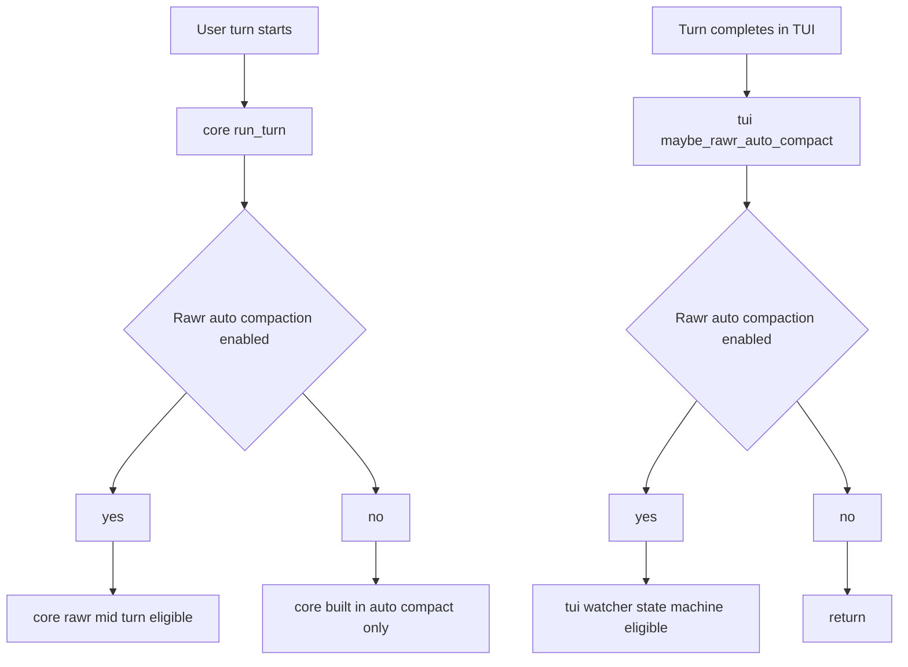
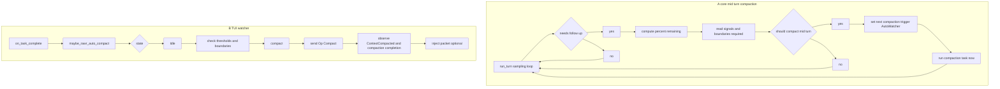
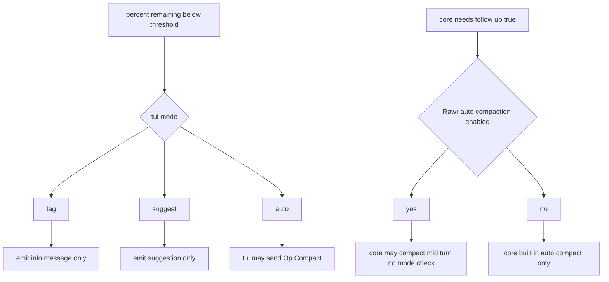
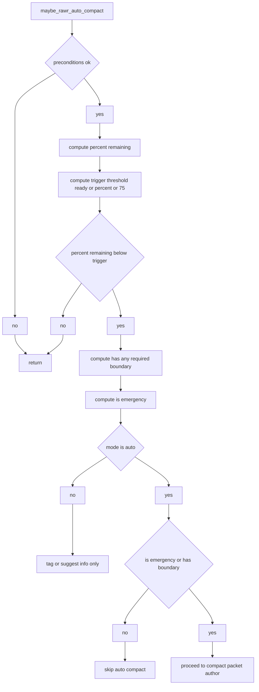
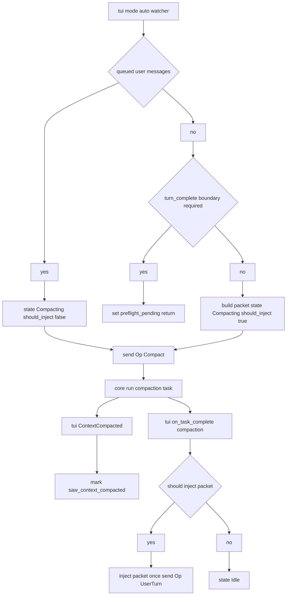
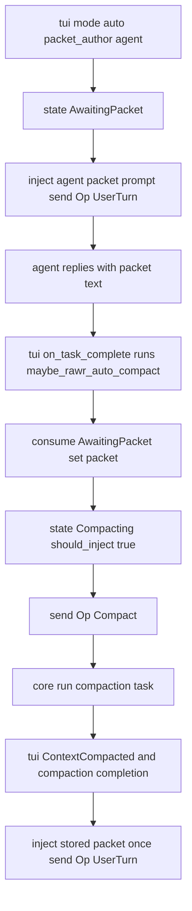
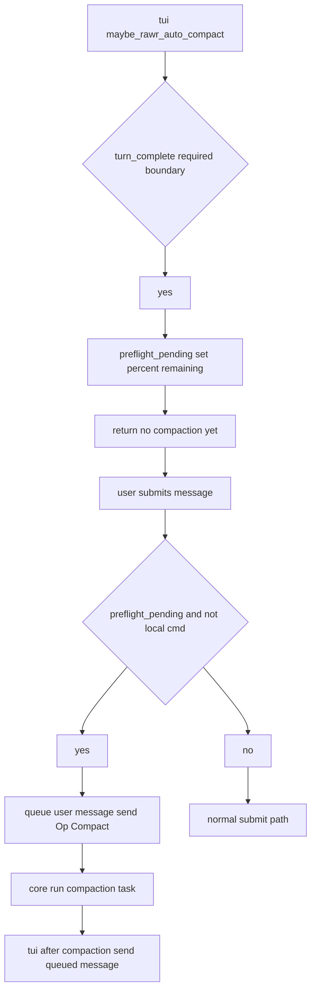
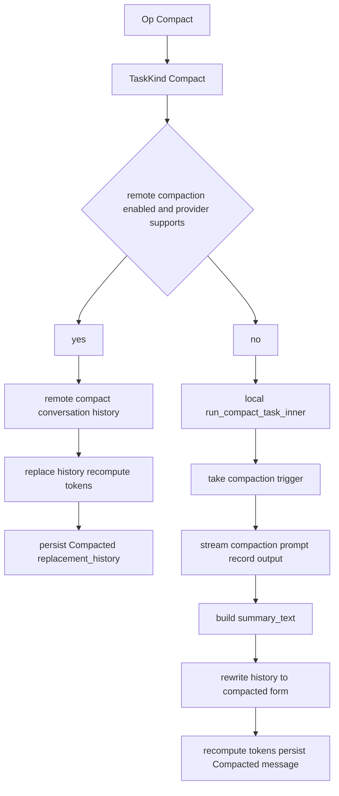
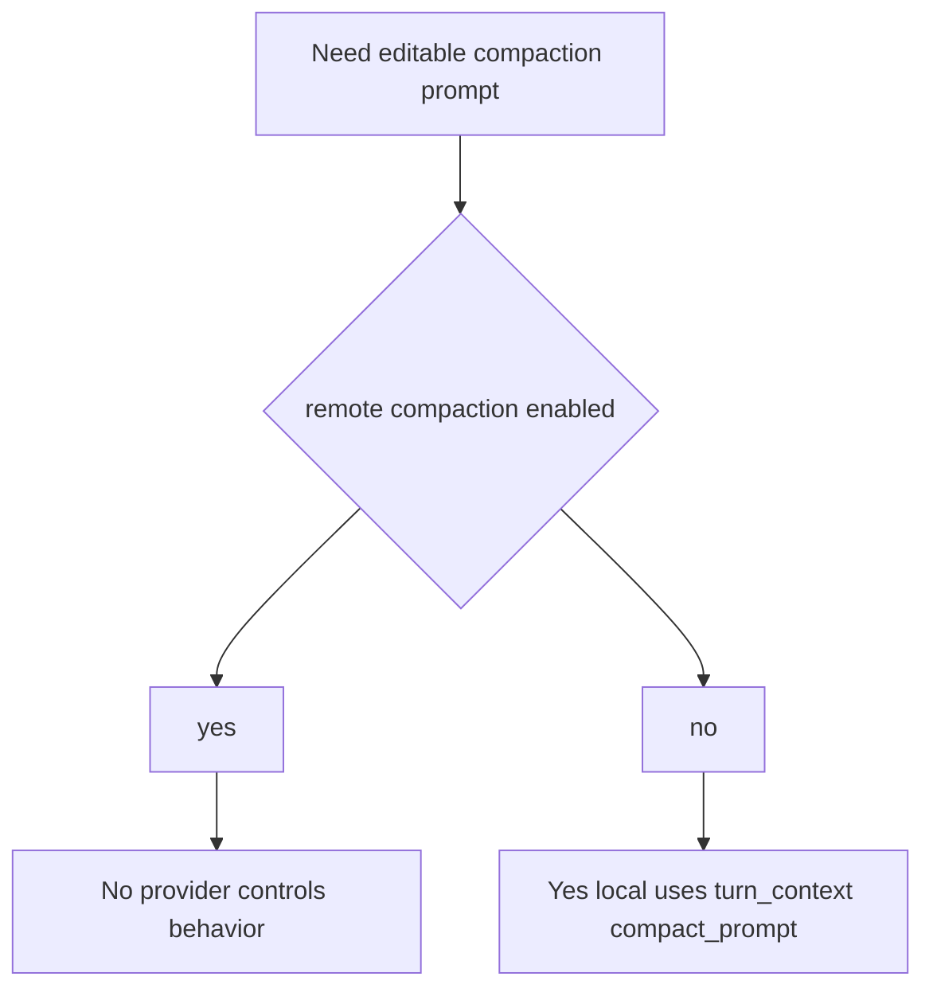

# Rawr auto-compaction handoff — exact workflows, invariants, and loop incentives

This doc is intended to be “mechanically precise”: what executes, in what order, what state/flags gate it, and where the handoff points are between:

- **Core** (`codex-rs/core`) sampling loop + compaction task execution
- **TUI** (`codex-rs/tui`) watcher state machine + post-compaction packet injection
- **Prompts** (local compaction prompt + rawr packet prompt) and what they “incentivize”

It focuses on **rawr auto-compaction**, but includes the closely related **built-in auto-compaction** and the **remote compaction** variant because they can change the effective behavior and the loop surfaces.

## Terminology

- **Turn**: a user input processed by the core `run_turn(...)` sampling loop.
- **Sampling request**: one “round trip” to the model within the same user turn; the loop can execute multiple sampling requests per user turn.
- **Compaction task**: `Op::Compact` → `TaskKind::Compact` which rewrites history (locally or via a remote provider feature).
- **Rawr mid-turn compaction**: core compaction **inside** `run_turn(...)` while `needs_follow_up == true`.
- **Rawr watcher compaction**: TUI-driven compaction at **turn completion** (and optionally “preflight” before the next user message).
- **Packet**: a “continuation context packet” injected as a synthetic user message after compaction to help the agent continue.

## Invariant: Rawr auto-compaction is feature-flag gated (both paths)

### A) Core gating (`Feature::RawrAutoCompaction`)

1. A user/agent turn starts in core `run_turn`. `codex-rs/core/src/codex.rs` (near `run_turn`).
2. Core computes `rawr_auto_compaction_enabled = sess.enabled(Feature::RawrAutoCompaction)`.
3. If disabled:
   - Core may run **built-in auto-compaction** (token-limit based) and **rawr mid-turn compaction never runs**.
   - In the sampling loop, built-in compaction can trigger when `token_limit_reached && needs_follow_up && !rawr_auto_compaction_enabled`.

### B) TUI gating (`Feature::RawrAutoCompaction`)

1. Turn completes in UI and `ChatWidget::maybe_rawr_auto_compact(...)` runs.
2. It early-returns if the feature flag is disabled.

## Invariant: There are two distinct rawr compaction workflows

These workflows are independent and can both fire over the lifetime of a thread.

### A) Core mid-turn compaction (between sampling requests)

1. Core runs the sampling loop for the current user turn (`run_turn`).
2. After each sampling request completes, core reads:
   - `needs_follow_up`
   - `sampling_request_last_agent_message`
3. If rawr enabled and the sampling request included a `last_agent_message`, core updates “semantic boundary” signals via heuristics:
   - `rawr_agent_message_looks_done`
   - `rawr_agent_message_looks_like_topic_shift`
   - `rawr_agent_message_looks_like_concluding_thought`
4. If `needs_follow_up == true`, core computes `percent_remaining` based on context window vs total usage.
5. Core reads `boundaries_required` from **config only**:
   - `rawr_auto_compaction.trigger.auto_requires_any_boundary` (defaults to `[]`).
6. Core reads the current per-turn boundary signals from the session (commit/plan/pr/etc).
7. Core decides whether to compact mid-turn via `rawr_should_compact_mid_turn(config, percent_remaining, signals, boundaries_required)`:
   - Uses **tiered thresholds** (Early/Ready/Asap/Emergency) from config.
   - Uses tier-allowed boundary sets unless `auto_requires_any_boundary` is set; emergency bypasses boundary gating.
8. If it returns `true`:
   - Core sets a “next compaction trigger” audit marker (`CompactionTrigger::AutoWatcher{...}`).
   - Core runs compaction immediately and then continues the same user-turn sampling loop (`continue;`).
9. No TUI packet injection state machine is involved in this path.

### B) TUI turn-complete watcher (and preflight)

1. A task/turn completes in the UI: `ChatWidget::on_task_complete(...)` runs.
2. It calls `maybe_rawr_auto_compact(last_agent_message)`.
3. This is a state machine over `rawr_auto_compaction_state`:
   - `Idle`
   - `AwaitingPacket{ trigger_percent_remaining }`
   - `Compacting{ packet, saw_context_compacted, saw_turn_complete, should_inject_packet, trigger_percent_remaining }`
4. If it decides to compact, it sends `Op::Compact` (which the core executes as a compaction task).
5. After compaction completes, the watcher injects a packet exactly once (depending on state + packet_author).

## Invariant: Mode affects only the TUI watcher (core mid-turn ignores mode)

### A) TUI watcher honors `rawr_auto_compaction.mode`

1. TUI loads `mode` from config, defaulting to `suggest`.
2. When below threshold:
   - `tag`: prints “would compact now” only.
   - `suggest`: prints “recommend compact now” only.
   - `auto`: may actually compact.

### B) Core mid-turn compaction does not check mode

1. Core checks only `Feature::RawrAutoCompaction` and `needs_follow_up` gating.
2. So even if the config is `mode = "suggest"`, the core mid-turn path can still compact (if the thresholds + boundary gating say so).

## Invariant: Exactly how the TUI watcher decides “should we compact now?”

1. Preconditions (any failure returns early):
   - `Feature::RawrAutoCompaction` enabled
   - not currently running a task/turn
   - not in review mode
2. Requires token info; computes `percent_remaining`.
3. Computes a single trigger threshold (current behavior):
   - `trigger_percent_remaining = ready_percent_remaining_lt OR percent_remaining_lt OR 75`
   - Note: `early_percent_remaining_lt` and `asap_percent_remaining_lt` exist in prompt YAML, but are **not used** in this TUI decision (as of current code).
4. If `percent_remaining >= trigger_percent_remaining`, returns (no action).
5. Computes “boundary present”:
   - Uses `auto_requires_any_boundary` from prompt YAML frontmatter, overridden by config if set.
   - Maps each boundary to a boolean (commit/pr_checkpoint/plan_checkpoint/plan_update/agent_done/topic_shift/concluding/turn_complete).
6. Computes emergency:
   - `is_emergency = percent_remaining < emergency_percent_remaining_lt`
7. In `mode = "auto"` only:
   - If `!is_emergency && !has_any_required_boundary`: prints “skipping auto compact (no natural boundary)” and returns.
   - Otherwise proceeds to compact (packet_author dependent).

## Invariant: `packet_author = "watcher"` (turn-complete auto) exact steps

1. TUI reaches `mode = auto`, and gating passes.
2. If there are queued user messages:
   - Sets `rawr_auto_compaction_state = Compacting{ packet: "", should_inject_packet: false, ... }`
   - Triggers compaction and returns (no post-compact injection).
3. Else, checks whether `auto_requires_any_boundary` includes `turn_complete`:
   - If yes (and this is the first time), sets `rawr_preflight_compaction_pending = Some(percent_remaining)`, sets state back to `Idle`, and returns (defers compaction).
4. Else (normal watcher auto):
   - Builds a continuation packet string (bounded tail; includes why compaction happened).
   - Sets `rawr_auto_compaction_state = Compacting{ packet, should_inject_packet: true, saw_context_compacted: false, saw_turn_complete: false, ... }`
   - Calls `rawr_trigger_compact()`.
5. `rawr_trigger_compact()`:
   - Records `CompactionTrigger::AutoWatcher{...}` for audit attribution (the upcoming compaction task).
   - Clears token usage and sends `AppEvent::CodexOp(Op::Compact)`.
6. Core receives `Op::Compact` and runs `codex::compact(...)`.
   - If the pending trigger is `AutoWatcher`, core uses a special compaction turn-context (model/effort/verbosity overrides).
7. Core runs the compaction task; when it finishes, the UI receives `EventMsg::ContextCompacted`.
8. On `ContextCompacted`:
   - Sets `saw_context_compacted = true` in the state (or injects immediately if `saw_turn_complete` was already true).
9. On the subsequent `on_task_complete` for the compaction task:
   - The watcher sees `Compacting{ saw_context_compacted: true, should_inject_packet: true }` and injects exactly once:
     - `rawr_inject_post_compact_packet(packet)`
     - `rawr_submit_injected_user_turn(packet)` → sends `Op::UserTurn`

## Invariant: `packet_author = "agent"` (turn-complete auto) exact steps

1. TUI reaches `mode = auto`, gating passes, `packet_author = agent`.
2. Sets `rawr_auto_compaction_state = AwaitingPacket{ trigger_percent_remaining }`.
3. Injects the “agent packet prompt” as a synthetic user turn (`Op::UserTurn`):
   - Prompt body comes from `rawr/prompts/rawr-auto-compact.md` (Markdown body; YAML frontmatter is settings).
   - If the embedded prompt cannot be loaded, it falls back to `default_rawr_agent_packet_prompt()`.
4. The agent responds in the next turn; when that agent turn completes, `maybe_rawr_auto_compact` runs again.
5. It consumes the `AwaitingPacket` state:
   - Takes `last_agent_message` (or fallback text), stores it as `packet`.
   - Transitions to `Compacting{ should_inject_packet: true, saw_context_compacted: false, ... }`.
   - Triggers `Op::Compact`.
6. After compaction completes, the watcher injects the stored packet once (same injection mechanics as the watcher-authored flow).

## Invariant: `turn_complete` boundary preflight (defer until next user message) exact steps

1. TUI watcher (in `auto` + `packet_author=watcher`) sees `auto_requires_any_boundary` contains `turn_complete`.
2. It sets `rawr_preflight_compaction_pending = Some(percent_remaining)` and returns (no compaction yet).
3. Later, when the user submits a message:
   - In `submit_user_message`, if `rawr_preflight_compaction_pending` is set and the message is not a local shell command (`!...`), the TUI:
     - pushes that user message back into the queue,
     - triggers compaction first,
     - returns.
4. After compaction completes, `maybe_send_next_queued_input()` submits the queued message as the next user turn.

## Invariant: What compaction actually does to the thread (history rewrite) — exact steps

This applies to: manual compact, built-in auto-compact, rawr mid-turn, and rawr watcher.

### Local compaction task (uses a prompt)

1. A compaction task runs `run_compact_task_inner(...)` (`codex-rs/core/src/compact.rs`).
2. It takes and clears the pending `compaction_trigger` (audit metadata) for this thread.
3. It records the compaction prompt input in the session history, then streams the compaction prompt to the model; output items are recorded into history.
4. It builds:
   - `summary_suffix = get_last_assistant_message_from_turn(history_items)`
   - `summary_text = SUMMARY_PREFIX + "\n" + summary_suffix`
5. It builds a new history:
   - initial context items
   - a bounded set of recent user messages
   - `summary_text` as a user message
   - plus any ghost snapshots
6. It replaces session history with that compacted history and recomputes token usage.
7. It persists `RolloutItem::Compacted{ trigger: compaction_trigger }`.

### Remote compaction task (provider-controlled; no local prompt control)

1. If the provider is OpenAI and `Feature::RemoteCompaction` is enabled, `TaskKind::Compact` uses the remote path.
2. The client performs `compact_conversation_history(&prompt)` and returns a rewritten history.
3. The session replaces history and recomputes tokens; the persisted `CompactedItem` stores `replacement_history` (and the `message` is empty).

## Variant / invariant: Can we modify “the compaction prompt we don’t control”?

It depends on whether you’re using **local** or **remote** compaction.

- **Local compaction**:
  - Uses `turn_context.compact_prompt()` as the synthesized input text for the compaction turn.
  - That prompt is configurable (config override or prompt-file override, depending on how the config is resolved).
- **Remote compaction**:
  - Does **not** use `turn_context.compact_prompt()`; it calls the provider’s “compact conversation history” operation.
  - In this mode, the “compaction prompt” is effectively provider-controlled; the local code does not send a user-editable compaction prompt string.

Practical implication:
- If you need to directly control the compaction prompt content, you must use **local** compaction (`Feature::RemoteCompaction` disabled).

## Prompt incentives and loop surfaces (why this can “want to loop”)

This section is not a claim that loops are guaranteed; it is a map of the incentives and feedback edges that can create repeated compactions.

### 1) Core mid-turn loop edge: “compact, then continue the same turn”

- In the sampling loop, core can:
  - trigger compaction when `needs_follow_up == true`,
  - then `continue;` the same loop.
- If compaction doesn’t sufficiently increase `percent_remaining` (or if a later sampling request re-consumes context rapidly), the mid-turn decision can evaluate `true` again.

### 2) Semantic-boundary heuristics can be “self-fulfilling” via prompts

Core’s semantic boundaries include:
- `rawr_agent_message_looks_like_concluding_thought` matches text like “next steps”.
- `rawr_agent_message_looks_done` matches “done”, “completed”, etc.

Rawr’s **agent packet prompt** explicitly asks for a structured packet including “next steps”, and many “packet-like” responses commonly include “completed” lists.

Consequence:
- The **act of generating a packet** can set semantic boundaries that later **unlock compaction**, especially in the Asap tier where `ConcludingThought` and `AgentDone` are allowed.

### 3) TUI watcher loop edge: “inject packet → run another user turn”

Watcher injection sends an `Op::UserTurn` after compaction, which creates more history items and triggers another agent response.

If after that turn the thread is still below the watcher threshold, the watcher can compact again at the next `on_task_complete`.

## Appendix: Key entrypoints and artifacts

- Core sampling loop: `codex-rs/core/src/codex.rs` (`run_turn`)
- Core boundary heuristics + mid-turn decision: `codex-rs/core/src/rawr_auto_compaction.rs`
- TUI watcher state machine: `codex-rs/tui/src/chatwidget.rs` (`maybe_rawr_auto_compact*`)
- Rawr packet prompt file: `rawr/prompts/rawr-auto-compact.md` (frontmatter + body)
- Local compaction logic: `codex-rs/core/src/compact.rs`
- Remote compaction logic: `codex-rs/core/src/compact_remote.rs`
