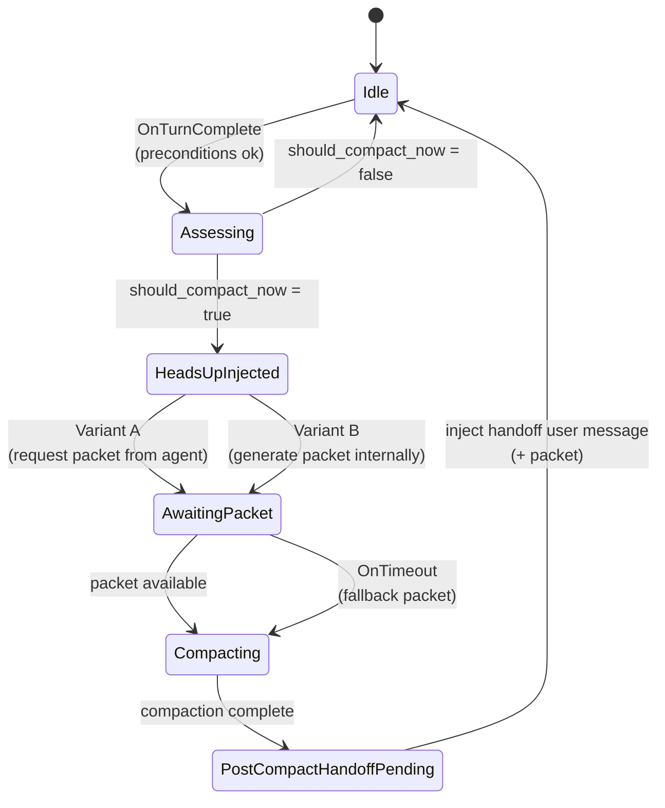
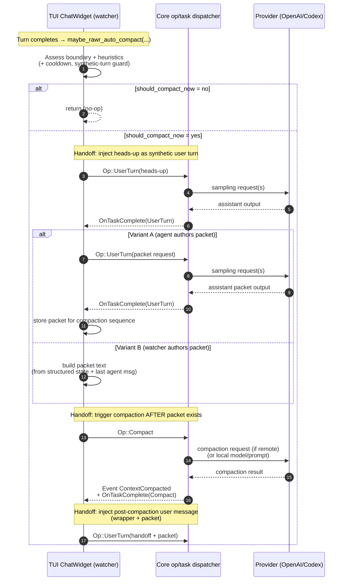

# Spec: Rawr auto-compaction golden-path UX (heads-up → packet → compact → handoff)

Status: Draft

This document specifies the **desired turn-based user experience** for Rawr auto-compaction, and a concrete “design diff” from the **current implementation** (core mid-turn compaction + TUI watcher compaction). It is written to be implementable.

Related (current behavior, mechanically precise):
- `rawr/issues/ISSUE-auto-compaction-handoff-workflow.md`

---

## Problem statement

We want to automate the “manual compact + continuation packet” dance that users currently perform to transition between **major, self-contained phases** of a long multi-step plan (research → draft → more research → harden → ship, etc.) without losing thread continuity.

Today’s auto-compaction mechanisms can:
- Trigger too often (boundaries treated as “sufficient”),
- Trigger in places that are confusing from a turn-based UX perspective (core mid-turn compaction),
- Produce post-compaction continuation messages that are not clearly attributed/structured for the in-session agent,
- Create loop surfaces (re-triggering on synthetic turns, sticky boundary signals, or low token budgets).

This spec defines a **golden path** and then enumerates **required behavior changes** to move the current system to that path.

---

## Goals / non-goals

### Goals

1. **Turn-based clarity**: from the transcript, it should be obvious what is happening and why.
2. **Agent continuity**: the in-session agent should receive a clear, structured handoff after compaction and continue seamlessly.
3. **Safety**: prevent infinite loops and “compaction thrash”.
4. **Deterministic sequencing**: define exact order, roles, and gating for heads-up → packet → compact → handoff.
5. **Incremental adoption**: allow “easy win” improvements without redesigning all compaction mechanisms in one step.

### Non-goals

- Changing compaction summarization quality (prompt/model). This spec focuses on orchestration and handoff UX.
- Replacing compaction itself. We keep the same compaction engine and history rewrite semantics.

---

## Terminology / roles

- **User**: human driving the session.
- **In-session agent**: the active assistant persona in the thread that is doing the work.
- **Watcher**: client-side orchestrator that decides *when* to compact and manages the sequence (TUI watcher today).
- **Compactor**: the compaction task that rewrites the thread history (local compaction or remote provider).
- **Continuation packet**: a structured “where we are / what we did / what’s next” packet meant to survive compaction and re-seed the agent.
- **Boundary**: a signal that a meaningful transition might exist (plan checkpoint/update, done/concluding/topic-shift, commit, PR, etc.).
- **Heuristics / contextual assessment**: additional logic that decides whether a boundary is “significant enough” to compact *now*.
- **Synthetic turn**: a turn injected by the watcher (e.g., heads-up, packet-request prompt, post-compaction handoff message).

---

## Golden-path workflow (turn-based UX)

### Invariant: boundaries are necessary but not sufficient

The watcher must treat boundary signals as **gating inputs**, not as an unconditional trigger:

- If *no boundary* is present, do not auto-compact (unless emergency).
- If a boundary is present, run a **contextual assessment** that can still decide “not yet”.

The intended effect is:
- Plan updates can happen frequently; only some of them represent a major phase completion or clean pivot.
- We compact at “clean handoff points”, not “any plan update”.

### Preconditions (must hold before starting an auto-compaction sequence)

1. Rawr auto-compaction feature flag is enabled.
2. The watcher is not already mid-sequence.
3. The UI is not in review mode (or any other mode where compaction must not occur).
4. Token information exists and percent remaining can be computed.
5. The watcher is not responding to a synthetic turn (see “Loop prevention”).

### Sequence: heads-up → packet → compact → handoff

When the watcher decides “yes, compact now”, the transcript must follow this order:

1. **Decision point (watcher internal)**:
   - Inputs: boundary signals + contextual assessment + token pressure.
   - Output: start auto-compaction sequence with a specific “reason” (boundary + heuristic rationale).

2. **Insert heads-up banner** (User message; required):
   - The watcher injects a **user-authored message** addressed to the in-session agent:
     - Explains: we’re pausing, you will create a continuation packet, we will compact, then we’ll give the packet back and continue.
     - Optionally includes light context (which plan stage completed).
   - This is mandatory once compaction has been decided; it is not “optional based on context”.

3. **Continuation packet is produced** (Assistant message; required):
   - The continuation packet must appear as authored by the in-session agent.
   - Content must include:
     - What just completed (summary of work and outputs/paths),
     - Current state (“where we are right now”),
     - Next steps (“what’s coming up next”),
     - Any critical constraints / decisions / open questions.

   There are two variants for who generates the text:
   - **Variant A (preferred): in-session agent writes it** in response to the heads-up prompt.
   - **Variant B (fallback): watcher generates it** but it must still be presented *as if* the in-session agent authored it (see “Open design questions” if assistant-role injection is not available).

4. **Compaction runs**:
   - After the continuation packet exists in the conversation, the watcher triggers compaction.
   - The packet must be treated as a primary preservation artifact (either preserved verbatim or preserved in equivalent structured form).

5. **Post-compaction handoff back to the agent** (User message; required):
   - After compaction completes, the watcher injects a **user-authored message** that:
     - Replays the continuation packet (or preserved equivalent),
     - Instructs the in-session agent to continue from it (“Continue from here.”).
   - The agent then continues with the next step in the plan.

### Desired transcript (happy path)

This is the user-visible shape of the golden path:

1. `User`: heads-up banner (“pause; write packet; we’ll compact; then continue”)
2. `Assistant`: continuation packet (“what I did / where I am / what’s next”)
3. (compaction task runs; may not show as a normal chat message)
4. `User`: post-compaction handoff (“here’s your packet back; continue” + packet)
5. `Assistant`: continues work

### UX-level workflow diagram (turn/interaction plane)

This diagram is intentionally not code-centric. It shows the turn-based transcript and responsibility handoffs.

```mermaid
sequenceDiagram
  autonumber
  participant U as User
  participant W as Watcher (client)
  participant A as In-session agent
  participant C as Compactor (task)

  Note over U,A: Ongoing multi-step plan (research → draft → harden)
  W->>W: Detect boundary + assess context
  alt should_compact_now = no
    W-->>A: (no special message; continue normal turns)
  else should_compact_now = yes
    U->>A: Heads-up: pause, write continuation packet, then compaction, then resume
    A->>U: Continuation packet (what/now/next + key constraints)
    Note over W,C: Handoff: watcher triggers compaction AFTER packet exists
    W->>C: Start compaction
    C-->>W: Context compacted (history rewritten)
    Note over U,A: Handoff: user re-seeds agent with packet post-compaction
    U->>A: Handoff: “Here’s your packet back; continue” + packet
    A-->>U: Continue next plan step
  end
```

---

## Contextual assessment (heuristics): “should we compact now?”

### Intended properties

- **Not too eager**: minor plan edits and partial milestones should not compact.
- **Stable**: the same boundary should not cause repeated compactions (edge-triggered).
- **Emergency escape hatch**: extremely low token budget can force compaction even if no boundary is present.

### Proposed heuristic inputs (implementable, not prompt-only)

1. **Boundary type and strength**
   - Strong boundaries: `agent_done`, `concluding`, `topic_shift`, `turn_complete`, `plan_checkpoint`, `commit`, `pr_opened`.
   - Weak boundaries: `plan_update` (often noisy).

2. **Cooldown**
   - Do not compact again within N turns or within M minutes unless emergency.

3. **Packet-worthiness**
   - Compact only if we can produce a meaningful continuation packet:
     - last agent message exists and is non-trivial,
     - or watcher can generate a minimal packet from structured state.

4. **Active-work detection**
   - Avoid compaction if:
     - a tool sequence is mid-flight,
     - user has queued inputs,
     - or the agent is clearly in the middle of an unfinished response (unless emergency).

5. **Phase-completion detection (optional, explicit)**
   - If the system has a structured “plan stage completed” event, use it.
   - Otherwise, prefer strong boundaries (`concluding`/`agent_done`) over weak ones (`plan_update`).

### Proposed decision rule (high-level)

```
should_compact_now =
  if emergency: true
  else if percent_remaining >= trigger_threshold: false
  else if !has_required_boundary: false
  else if !passes_contextual_assessment: false
  else: true
```

This rule is intentionally explicit: “below threshold” and “boundary present” are required, but not sufficient.

---

## Target state machine (implementable)

This section defines an implementable watcher state machine in terms of events, state, and transitions. It is written to map onto the existing TUI watcher design.

### States

- `Idle`
- `Assessing { trigger_reason, trigger_percent_remaining }`
- `HeadsUpInjected { trigger_reason, trigger_percent_remaining }`
- `AwaitingPacket { trigger_reason, trigger_percent_remaining, packet_deadline }`
- `Compacting { trigger_reason, packet, saw_context_compacted, saw_turn_complete }`
- `PostCompactHandoffPending { packet }`

### Events

- `OnTurnComplete(last_agent_message, token_usage, boundary_signals, ...)`
- `OnUserSubmitMessage(text)` (for preflight style “compact before next message”)
- `OnContextCompacted` (UI event)
- `OnTaskComplete(task_kind)` (including compaction task completion)
- `OnTimeout` (packet deadline)

### Transitions (golden path)

1. `Idle` → `Assessing` on `OnTurnComplete` if preconditions hold.
2. `Assessing` → `Idle` if `should_compact_now == false`.
3. `Assessing` → `HeadsUpInjected` if `should_compact_now == true`:
   - Inject heads-up user message (synthetic turn).
4. `HeadsUpInjected` → `AwaitingPacket`:
   - Trigger next assistant turn to produce packet (Variant A),
   - or generate packet internally (Variant B) and present it as assistant-authored (open question if not supported).
5. `AwaitingPacket` → `Compacting` when packet is available:
   - Trigger compaction task.
6. `Compacting` → `PostCompactHandoffPending` on compaction completion.
7. `PostCompactHandoffPending` → `Idle` after injecting post-compaction user handoff message.

### Code-level workflow diagrams (implementation plane)

These diagrams are intentionally code-centric and separate from the UX-level interaction diagram above.

#### Target watcher state machine



#### Target component/event handoffs (TUI watcher ↔ core ↔ provider)



### Loop prevention requirements (state-machine level)

The watcher must treat these as “non-triggering” contexts:
- turns injected by heads-up,
- the packet-writing turn (assistant response),
- the post-compaction handoff turn.

Implementation-wise, this requires an explicit “this turn is part of auto-compaction sequence” marker and/or a cooldown.

---

## Current behavior (summary, based on existing workflows)

This section is intentionally short; full detail lives in `rawr/issues/ISSUE-auto-compaction-handoff-workflow.md`.

### Path 1: Core mid-turn compaction (sampling loop)

- Can compact inside a single user turn while `needs_follow_up == true`.
- Triggered by token pressure + tiered thresholds + boundary heuristics.
- **Not turn-based** from the transcript’s perspective (no heads-up, no packet-writing step).

### Path 2: TUI watcher (turn completion + preflight)

- On turn completion, may decide to compact based on:
  - percent remaining threshold,
  - `auto_requires_any_boundary` list,
  - emergency override.
- `mode` controls whether it actually compacts (`auto`) or merely prints messages (`tag`/`suggest`).
- Two packet approaches:
  - `packet_author=agent`: injects a packet prompt as a synthetic user turn, waits for agent response, then compacts, then injects the packet as a synthetic user turn.
- `packet_author=watcher`: watcher builds a packet string itself, compacts, then injects the packet as a synthetic user turn.

### Current implementation touchpoints (for implementers)

This spec assumes the current structure documented in `rawr/issues/ISSUE-auto-compaction-handoff-workflow.md`:

- **Core mid-turn logic**
  - `codex-rs/core/src/codex.rs` (`run_turn` sampling loop decision + trigger)
  - `codex-rs/core/src/rawr_auto_compaction.rs` (`rawr_should_compact_mid_turn(...)`)
- **Compaction execution**
  - `codex-rs/core/src/codex.rs` (`Op::Compact` handling)
  - `codex-rs/core/src/compact.rs` (history rewrite)
  - `codex-rs/core/src/compaction_audit.rs` (attribution via `CompactionTrigger`)
- **TUI watcher orchestration**
  - `codex-rs/tui/src/chatwidget.rs`:
    - `ChatWidget::on_task_complete(...)` → `maybe_rawr_auto_compact(...)`
    - `rawr_auto_compaction_state` (includes `AwaitingPacket` and `Compacting`)
    - `rawr_preflight_compaction_pending`
    - `submit_user_message(...)` preflight interception and queueing

---

## Design diff: current → golden path

This section is the actionable “what needs to change” delta.

### 1) Add heads-up banner (required)

**Golden path** requires a heads-up user message before packet generation and before compaction.

**Current**:
- `packet_author=agent` injects a packet prompt, but does not guarantee a standardized “heads-up” message.
- `packet_author=watcher` compacts immediately (or preflights) without a heads-up.

**Required change**:
- When the watcher decides to compact, it must inject the standardized heads-up **first**, as a user message.
- This heads-up should come from the existing heads-up prompt artifact (in the branch above), with optional minimal contextualization.

**Concrete design for today’s watcher state machine**:

- Introduce an explicit intermediate state that represents “heads-up injected; packet still needed”, e.g.:
  - `AwaitingPacket` becomes `HeadsUpInjectedAwaitingPacket` (or add a separate `HeadsUpInjected` state).
- For `packet_author=agent`:
  1. On turn-complete compaction decision: inject heads-up as a synthetic user turn.
  2. Transition state to “awaiting packet” and inject the packet request turn (if separate) or rely on the agent to respond to the heads-up with a packet.

### 2) Continuation packet must appear agent-authored (required)

**Golden path** requires that the continuation packet appear to be authored by the in-session agent.

**Current**:
- `packet_author=agent` satisfies this naturally (assistant produces the packet).
- `packet_author=watcher` stores a packet string and later injects it via a synthetic user turn (not agent-authored in transcript).

**Required change**:
- Prefer Variant A (`packet_author=agent`) by default when feasible.
- If Variant B remains, define how to represent watcher-generated packet as “agent-authored” or accept an explicit fallback UX (see open questions).

**Concrete design choices to implement**:

- If we keep `packet_author=watcher`, we must pick one:
  - **B1 (preferred UX):** watcher can inject an assistant-role message (the packet) into the transcript/history.
  - **B2 (honest fallback):** watcher injects a user-role message labeled “system-generated continuation packet (watcher)” and the post-compaction handoff is still user-authored.
  - **B3 (remove):** drop watcher-authored packets; always request packet from in-session agent, and only compact when it is produced (emergency still possible).

### 3) Post-compaction handoff must be explicit and standardized (required)

**Golden path** requires that the post-compaction packet reintroduction be a user message like:
“Here’s your packet back; continue from here.”

**Current**:
- Injection exists, but may be raw packet text without a consistent wrapper and without an explicit instruction to continue.

**Required change**:
- Wrap injected packet content in a standardized **handoff user message**.
- Preserve the packet in a clearly delimited block and include the “continue from here” directive.

**Concrete change in watcher flow**:

- Where the watcher currently calls its “inject packet” routine, treat the injected payload as:
  - `handoff_message = format!("(handoff preface)\\n\\n```\\n{packet}\\n```\\n\\nContinue from here.")`
- This wrapper must be stable so we can add synthetic-turn guards keyed on it (see loop prevention).

### 4) Add contextual assessment layer (required)

**Golden path** requires “boundaries necessary but not sufficient”.

**Current**:
- Watcher primarily uses threshold + `auto_requires_any_boundary` (plus emergency).
- Core uses additional heuristics for boundary signals, but that doesn’t translate into turn-based UX and can still be eager.

**Required change**:
- Introduce a watcher-side `passes_contextual_assessment` step that can veto compaction even when a boundary exists.
- Start with implementable, low-risk heuristics:
  - cooldown,
  - strong-boundary preference (e.g., only compact on `plan_update` when `concluding`/`agent_done` is also true),
  - ignore boundaries derived from synthetic turns.

**Concrete design (minimal viable heuristics)**:

- Add a “cooldown” gate:
  - Do not start a new auto-compaction sequence until:
    - at least `cooldown_turns` user turns have completed since the last compaction, or
    - at least `cooldown_seconds` have elapsed,
    - unless emergency.
- Treat `plan_update` as weak:
  - If the only boundary present is `plan_update`, do not compact unless one of:
    - `concluding` is also present,
    - `agent_done` is also present,
    - `topic_shift` is also present,
    - `plan_checkpoint` is present,
    - emergency.

### 5) Resolve core mid-turn compaction vs turn-based UX (required decision)

**Golden path** describes turn-complete orchestration with heads-up and packet-writing. Core mid-turn compaction can violate this UX.

**Current**:
- Core mid-turn compaction can run regardless of watcher `mode` and without heads-up/packet steps.

**Required change (design decision)**:
Choose one of:
1. Disable core mid-turn rawr compaction when the watcher is responsible for golden-path UX (turn-based mode), or restrict it to emergency-only.
2. Keep core mid-turn compaction, but accept that it is not golden-path UX and explicitly document the UX mismatch.
3. Re-architect core mid-turn compaction to request packets and show heads-up, which is likely infeasible without turning it into a watcher-orchestrated flow.

**Additional concrete constraint**:

Even if we improve the watcher path, core mid-turn compaction can still:
- compact “silently” mid-turn (no heads-up),
- rewrite history before the packet workflow can run,
- produce perceived “random” compaction from the user’s perspective.

So, implementing golden-path UX in the watcher without a policy for core mid-turn compaction is likely insufficient.

### 6) Harden loop prevention (required)

**Golden path** requires at-most-once semantics per boundary event and immunity to synthetic-turn retriggers.

**Current**:
- There are multiple retrigger surfaces:
  - token pressure remains low after compaction,
  - boundaries can be sticky (plan_update),
  - watcher can observe its own injected turns.

**Required change**:
- Add explicit markers / sequence IDs so:
  - synthetic turns do not contribute boundaries,
  - the watcher ignores turn-complete events for the auto-compaction synthetic turns,
  - a cooldown prevents repeated compaction immediately after a compaction.

**Concrete loop surfaces to address (from today’s behavior)**:

- **Synthetic turn feedback**: watcher observes its own injected turns and treats their completion as “new turn completed”.
- **Sticky boundary signals**: a “plan updated” signal that stays true across turns can continuously satisfy boundary gating.
- **Low remaining budget persists**: if compaction doesn’t materially raise `percent_remaining`, thresholds can immediately re-fire.
- **Queued user input shortcut**: today, queued user messages can cause the watcher to compact without post-compact injection (`should_inject_packet=false`), which can lead to confusion and repeated attempts to recover context.

**Concrete requirement for queued input** (design choice):

If there are queued user inputs, golden path still expects:
1) heads-up,
2) packet,
3) compaction,
4) post-compaction handoff,
5) then deliver queued input.

If that ordering is not feasible, we must explicitly define the alternate ordering and guard it against loops.

---

## Open design questions (must be decided explicitly)

1. **Can we inject assistant-role messages from the watcher?**
   - Needed to make watcher-generated packets appear agent-authored (Variant B) without lying about authorship.
   - If not supported, do we:
     - Remove Variant B entirely, or
     - Accept a user-visible “system-generated packet” that is clearly labeled as such?

2. **What is the canonical heads-up prompt artifact and where should it live?**
   - Is it a markdown prompt file under `rawr/prompts/`?
   - Should it be configurable or always standardized?

3. **How do we represent “significant plan step complete” robustly?**
   - Option A: a new explicit structured signal/event (preferred if available).
   - Option B: heuristic combination of existing boundaries (concluding/done/topic_shift + plan checkpoint).
   - Option C: prompt-derived inference (fragile; avoid as primary driver).

4. **How should this interact with remote compaction prompt control?**
   - If remote compaction uses a provider-owned prompt, does the continuation packet need a stricter format to reliably survive?

5. **Where should the “golden-path mode” be configured?**
  - Extend existing rawr auto-compaction config (`mode`, thresholds, required boundaries) with a “turn_based_handoff=true” flag?
  - Or create a separate “handoff workflow” config sub-table?

6. **How should preflight (`turn_complete` boundary) interact with the golden path?**
   - Today, preflight defers compaction until the next user message submission.
   - Golden path requires heads-up + packet before compaction; that implies we may need to:
     - start the heads-up/packet sequence at turn completion (then compact immediately), or
     - start the sequence at next user submission (but that blocks the user’s message until the sequence completes).
   - If we keep preflight, the UX needs to be explicitly specified and guarded against loops.

---

## Implementation outline (suggested sequence)

This is intentionally incremental (minimize risk, maximize immediate UX improvement):

1. Add standardized **heads-up user message** before packet request/compaction in watcher path.
2. Wrap post-compaction injection in standardized **handoff user message**.
3. Add watcher-side **synthetic-turn guard** and **cooldown** to prevent loops.
4. Add watcher-side **contextual assessment** (strong-boundary preference; plan_update not sufficient).
5. Decide and implement the **core mid-turn compaction policy** under golden-path mode.
